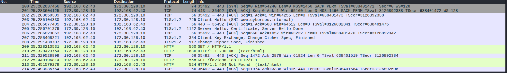
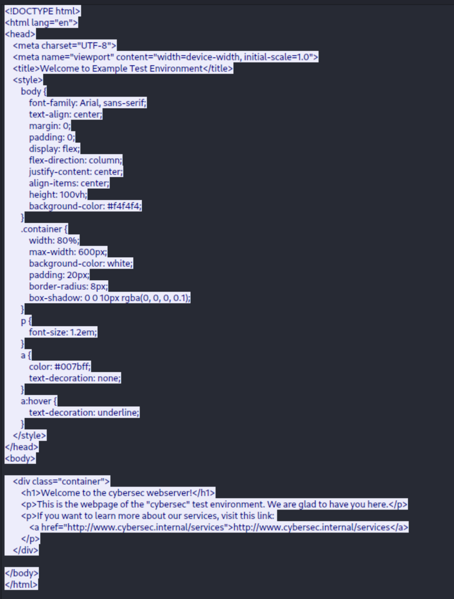
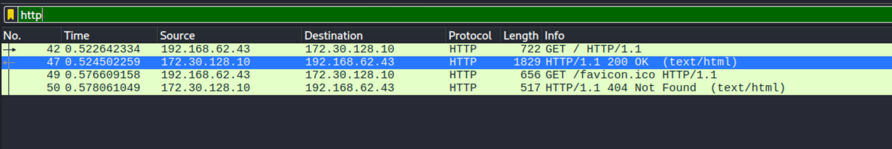
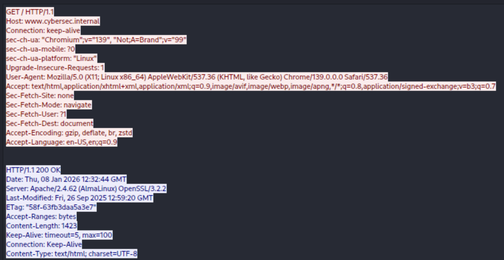

# Lab 6

## Webserver: Reverse proxy

1. **What webserver software is being used on the webserver? (apache, nginx, iis, ...)**

    Using `sudo ss -tulnp` I can see that the service httpd is running on port 80. This means that an Apache webserver is running.

2. **How is the webserver configured as a reverse proxy? Where is this defined? What config file?**

    The reverse porxy configuration is defined in "/etc/httpd/conf/httpd.conf". In here we can find the following proxy configuration:

    ```txt
    ProxyPass "/services" "http://localhost:9200"
    ProxyPassReverse "/services" "http://localhost:9200"
    ProxyPass "/cmd" "http://localhost:8000/"
    ProxyPassReverse "/aaa" "http://localhost:8000/"
    ProxyPass "/assets" "http://localhost:8000/assets"
    ProxyPassReverse "/assets" "http://localhost:8000/assets"
    ProxyPass "/exec" "http://localhost:8000/exec"
    ProxyPassReverse "/exec" "http://localhost:8000/exec"
    ```

3. Since we know that /cmd and /services are both systemd services we can look for them using the following command: `ls /etc/systemd/system/*.service`. I found 2 entries:
    - "/etc/systemd/system/flaskapp.service": if I look in the file I can see it uses python.
    - "/etc/systemd/system/insecurewebapp.service": if I look in the file I can see it uses java.

To look for the port, I use `sudo ss -tulnp`. I can see that the java service is running on port 8000. But I cant see the python service running. I check the status `sudo systemctl status flaskapp.sercvice` and is it failed. I need to change the configuration from "ExecStart=/usr/bin/python /opt/flask/app.py" to "ExecStart=/usr/bin/python3 /opt/flask/app.py". Now I restart the service and look for the port. It is running on port 9200.

## Certification Authority

**Does the CA uses a private key?** Yes

**Does the CA uses a certificate?** Yes

**Does the web server uses a private key?** Yes

**Does the web server uses a certificate?** Yes

**When using openssl commands to generate files, are you able to easily spot the function/goal of each file?** Yes, the extension and naming conventions.

**How can you view a certificate using openssl?** `openssl x509 -in certificate.crt -text -noout`

**Does the webserver need a specific configuration change to allow HTTPS traffic?** Yes, add the sslcertificate, enable mod_ssl

**What is meant by a CSR?** Certificate Signing Request, a file that contains: public key, identity info and SAN (Subject Alternative Names)

**Tip: Do not forget the SAN (Subject Alternative Name) attribute!**

**What is a wildcard certificate?** A certificate where the CN (Common Name) is \*.example.com, It covers all subdomains: mail.example.com, api.example.com, etc.

**Tip: (For the optional part below you might want to support a wildcard certificate, ask yourself is this is safe or not?)** It is not safe, if the private key leaks, attackers can impersonate any subdomain.

**What file(s) did you add to the browser (or computer) and how?** The CA's self-signed certificate (.crt)

-   Windows: certmgr.msc → Trusted Root CAs → Import → select CA cert
-   Linux: Copy to /etc/ssl/certs/ or import via system settings
-   Browser: Settings → Privacy → Certificates → Import

**Can you easily retrieve your certificates after adding them?** Yes

-   Windows: certmgr.msc → view/export
-   Linux: openssl x509 -in /etc/ssl/certs/ca-cert.pem -text -noout
-   Browser: Settings → Certificates → view/export

## HTTPS TLS 1.2

1. Generate a CA (Certificate Authority)

```bash
# Generate CA private key (RSA 2048)
openssl genrsa -out ca.key 2048

# Generate CA self-signed certificate
openssl req -new -x509 -days 3650 -key ca.key -out ca.crt -subj "/C=BE/ST=Gent/L=Gent/O=CyberSec/CN=CyberSec-CA"
```

2. Generate Web Server Keys and CSR

```bash
# Generate web server private key (RSA 2048)
openssl genrsa -out server.key 2048

# Create a config file for SAN
cat > san.conf << 'EOF'
[req]
distinguished_name = req_distinguished_name
req_extensions = v3_req
prompt = no

[req_distinguished_name]
C = BE
ST = Gent
L = Gent
O = CyberSec
CN = www.cybersec.internal

[v3_req]
subjectAltName = DNS:www.cybersec.internal,DNS:cybersec.internal
EOF

# Generate CSR with SAN
openssl req -new -key server.key -out server.csr -config san.conf

# Sign CSR with CA (valid 365 days)
openssl x509 -req -in server.csr -CA ca.crt -CAkey ca.key \
  -CAcreateserial -out server.crt -days 365 \
  -extensions v3_req -extfile san.conf
```

3. Move certificates to Apache

```bash
sudo mkdir -p /etc/httpd/ssl
sudo cp server.key /etc/httpd/ssl/
sudo cp server.crt /etc/httpd/ssl/
sudo chmod 600 /etc/httpd/ssl/server.key
sudo chmod 644 /etc/httpd/ssl/server.crt
```

4. Configure Apache for TLS 1.2 + RSA + Legacy Ciphers

    1. Install SSL module (if not already): `sudo dnf install -y mod_ssl`

    2. Paste this in "/etc/httpd/conf.d/ssl.conf"

        ```txt
        # Listen on 443 for HTTPS
        Listen 443 https

        # Redirect all HTTP to HTTPS
        <VirtualHost *:80>
            ServerName www.cybersec.internal
            Redirect permanent / https://www.cybersec.internal/
        </VirtualHost>

        # HTTPS vhost: TLS 1.2 only, RSA-only (no ECDHE/PFS)
        <VirtualHost *:443>
            ServerName www.cybersec.internal
            ServerAdmin admin@cybersec.internal

            SSLEngine on
            SSLProtocol TLSv1.2
            SSLCertificateFile /etc/httpd/ssl/server.crt
            SSLCertificateKeyFile /etc/httpd/ssl/server.key

            # Disable modern/PFS suites; stick to RSA key exchange
            SSLCipherSuite HIGH:!aNULL:!eNULL:!EXPORT:!DES:!RC4:!MD5:!PSK:!SRP:!CAMELLIA:!ECDH:!ECDHE
            SSLHonorCipherOrder on

            # Reverse proxy routes
            ProxyPass        "/services" "http://localhost:9200"
            ProxyPassReverse "/services" "http://localhost:9200"
            ProxyPass        "/cmd" "http://localhost:8000/"
            ProxyPassReverse "/cmd" "http://localhost:8000/"
            ProxyPass        "/assets" "http://localhost:8000/assets"
            ProxyPassReverse "/assets" "http://localhost:8000/assets"
            ProxyPass        "/exec" "http://localhost:8000/exec"
            ProxyPassReverse "/exec" "http://localhost:8000/exec"

            DocumentRoot "/var/www/html"
            <Directory "/var/www/html">
                Require all granted
            </Directory>

            ErrorLog logs/ssl_error_log
            CustomLog logs/ssl_access_log combined
        </VirtualHost>
        ```

5. Ensure cert/key exist and permissions are right:

    ```bash
    sudo ls -l /etc/httpd/ssl/server.{crt,key}
    sudo chmod 600 /etc/httpd/ssl/server.key
    sudo chmod 644 /etc/httpd/ssl/server.crt
    ```

6. Restart: `sudo systemctl restart httpd`

7. Verify: `sudo ss -tulnp | grep 443` & `openssl s_client -connect www.cybersec.internal:443 -tls1_2 -cipher 'RSA'`

8. Copy the content of ca.crt to a file on Kali. Add the certificate to the browser.
9. Test: Open https://www.cybersec.internal/ in an incognito window. (on Kali)

**!Change the firewall so HTTPS is accepted!**

### Wireshark

We can decrypt the traffic using the webserver's private key (server.key). Copy the key from the webserver in the Kali linux.

Now we need to import the private key to be able to decrypt. Edit → Preferences → Protocols → TLS (or SSL) → RSA keys list → Edit → Add the private key file path.

After importing the server private key, we can see HTTP packets in wireshark:


To see the content in the TLS stream. Here we can see the content of the HTTP packet:


Write the TLS1.2 configuration to a file so it is not lost: `sudo cp /etc/httpd/conf.d/ssl.conf /etc/httpd/conf.d/ssl.conf.tls12.backup`

## HTTPS TLS 1.3

We need to change the /etc/httpd/conf.d/ssl.conf so it supports TLS1.3:

```txt
# Listen on 443 for HTTPS
Listen 443 https

# Redirect all HTTP to HTTPS
<VirtualHost *:80>
    ServerName www.cybersec.internal
    Redirect permanent / https://www.cybersec.internal/
</VirtualHost>

# HTTPS vhost: TLS 1.3 only
<VirtualHost *:443>
    ServerName www.cybersec.internal
    ServerAdmin admin@cybersec.internal

    SSLEngine on
    SSLProtocol TLSv1.3
    SSLCertificateFile /etc/httpd/ssl/server.crt
    SSLCertificateKeyFile /etc/httpd/ssl/server.key

    # Reverse proxy routes
    ProxyPass        "/services" "http://localhost:9200"
    ProxyPassReverse "/services" "http://localhost:9200"
    ProxyPass        "/cmd" "http://localhost:8000/"
    ProxyPassReverse "/cmd" "http://localhost:8000/"
    ProxyPass        "/assets" "http://localhost:8000/assets"
    ProxyPassReverse "/assets" "http://localhost:8000/assets"
    ProxyPass        "/exec" "http://localhost:8000/exec"
    ProxyPassReverse "/exec" "http://localhost:8000/exec"

    DocumentRoot "/var/www/html"
    <Directory "/var/www/html">
        Require all granted
    </Directory>

    ErrorLog logs/ssl_error_log
    CustomLog logs/ssl_access_log combined
</VirtualHost>
```

Restart Appache: `sudo systemctl restart httpd`

Verify it works: `echo -e "GET / HTTP/1.1\r\nHost: www.cybersec.internal\r\nConnection: close\r\n\r\n" | openssl s_client -connect www.cybersec.internal:443 -tls1_3 -quiet`

output:

```html
nect www.cybersec.internal:443 -tls1_3 -quiet Connecting to 127.0.2.1 depth=0
C=BE, ST=Gent, L=Gent, O=CyberSec, CN=www.cybersec.internal verify
error:num=20:unable to get local issuer certificate verify return:1 depth=0
C=BE, ST=Gent, L=Gent, O=CyberSec, CN=www.cybersec.internal verify
error:num=21:unable to verify the first certificate verify return:1 depth=0
C=BE, ST=Gent, L=Gent, O=CyberSec, CN=www.cybersec.internal verify return:1
HTTP/1.1 200 OK Date: Thu, 08 Jan 2026 12:09:19 GMT Server: Apache/2.4.62
(AlmaLinux) OpenSSL/3.2.2 Last-Modified: Fri, 26 Sep 2025 12:59:20 GMT ETag:
"58f-63fb3daa5a3e7" Accept-Ranges: bytes Content-Length: 1423 Connection: close
Content-Type: text/html; charset=UTF-8

<!DOCTYPE html>
<html lang="en">
    <head>
        <meta charset="UTF-8" />
        <meta name="viewport" content="width=device-width, initial-scale=1.0" />
        <title>Welcome to Example Test Environment</title>
        <style>
            body {
                font-family: Arial, sans-serif;
                text-align: center;
                margin: 0;
                padding: 0;
                display: flex;
                flex-direction: column;
                justify-content: center;
                align-items: center;
                height: 100vh;
                background-color: #f4f4f4;
            }
            .container {
                width: 80%;
                max-width: 600px;
                background-color: white;
                padding: 20px;
                border-radius: 8px;
                box-shadow: 0 0 10px rgba(0, 0, 0, 0.1);
            }
            p {
                font-size: 1.2em;
            }
            a {
                color: #007bff;
                text-decoration: none;
            }
            a:hover {
                text-decoration: underline;
            }
        </style>
    </head>
    <body>
        <div class="container">
            <h1>Welcome to the cybersec webserver!</h1>
            <p>
                This is the webpage of the "cybersec" test environment. We are
                glad to have you here.
            </p>
            <p>
                If you want to learn more about our services, visit this link:
                <a href="http://www.cybersec.internal/services"
                    >http://www.cybersec.internal/services</a
                >
            </p>
        </div>
    </body>
</html>
```

### Wireshark

**Why does the old metic doesn't work anymore?** Because TLS uses the static-RSA key exchange. Possessing the server’s private key let you recover that premaster and derive the session keys.

Using the SSLKEYLOGFILE:

```zsh
┌──(vagrant㉿red)-[~]
└─$ pkill chromium

┌──(vagrant㉿red)-[~]
└─$ rm -f $HOME/sslkeys.log

┌──(vagrant㉿red)-[~]
└─$ export SSLKEYLOGFILE=$HOME/sslkeys.log

┌──(vagrant㉿red)-[~]
└─$ wireshark &

# start a capture at eth1 (fake internet)

┌──(vagrant㉿red)-[~]
└─$ chromium --incognito https://www.cybersec.internal/ &
```

To decrypt TLS1.3 I need to import the sslkeys.log in wireshark. Edit → Preferences → Protocols → TLS (or SSL) → (Pre)-Master-Secret log filename → "/home/vagrant/sslkeys.log" → OK.

You can now see HTTP packets!



## On host

I also copied the ca.crt from the web vm to my host-laptop. I saved in under "cybersec.crt" and imported in my browser. _Make sure that it hase the file-extension .crt_
