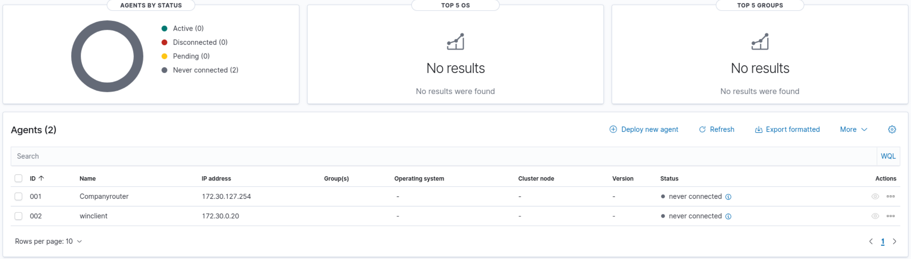
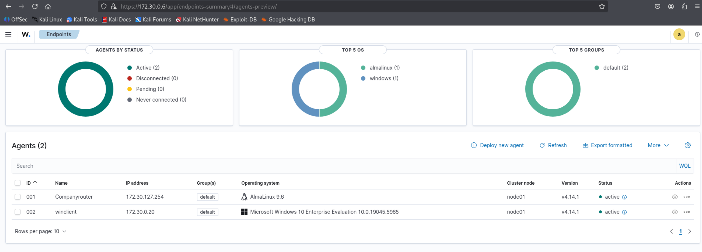
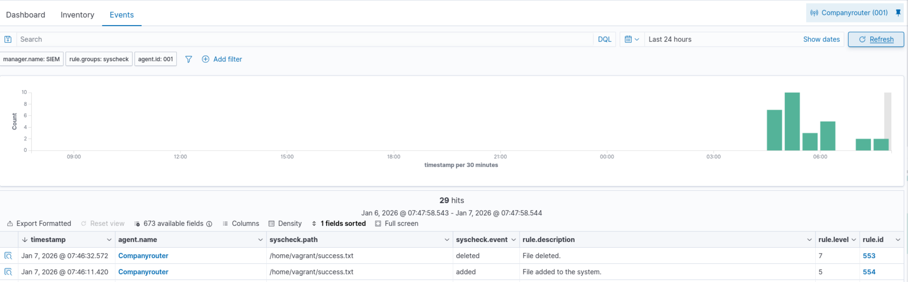
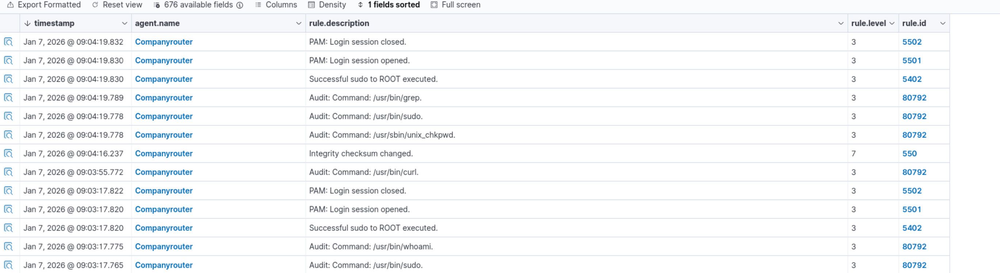
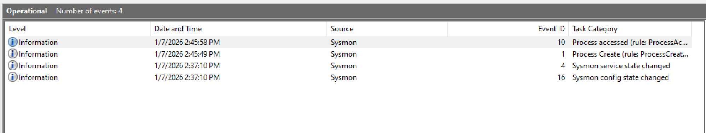
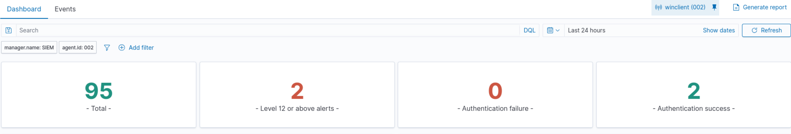
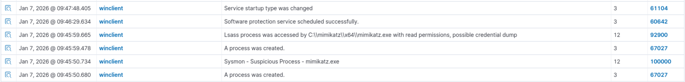

# Lab 07

## Wazuh server

Follow the guide for the indexer, server & dashboard.

Wazuh username and password: admin:admin

indexer_username: 'admin'
indexer_password: 't.MVeFnIJ0QaR556p15EMj\*nnIKfWL?V'/ admin

config.yml -> Add the correct ip to the config (everything is 172.30.0.6)

```yml
nodes:
    # Wazuh indexer nodes
    indexer:
        - name: node-1
          ip: "172.30.0.6"
        #- name: node-2
        #  ip: "<indexer-node-ip>"
        #- name: node-3
        #  ip: "<indexer-node-ip>"

    # Wazuh server nodes
    # If there is more than one Wazuh server
    # node, each one must have a node_type
    server:
        - name: wazuh-1
          ip: "172.30.0.6"
        #  node_type: master
        #- name: wazuh-2
        #  ip: "<wazuh-manager-ip>"
        #  node_type: worker
        #- name: wazuh-3
        #  ip: "<wazuh-manager-ip>"
        #  node_type: worker

    # Wazuh dashboard nodes
    dashboard:
        - name: dashboard
          ip: "172.30.0.6"
```

The Wazuh Indexer correctly installed?

[vagrant@SIEM ~]$ sudo curl -k -u admin https://172.30.0.6:9200
Enter host password for user 'admin':
{
"name" : "node-1",
"cluster_name" : "wazuh-cluster",
"cluster_uuid" : "Qist-LtPQpy2zFkn_9qDmQ",
"version" : {
"number" : "7.10.2",
"build_type" : "rpm",
"build_hash" : "ac8f6e0114b657a116c4a41c3e12f8e0e181bbcd",
"build_date" : "2025-11-08T11:55:34.225460336Z",
"build_snapshot" : false,
"lucene_version" : "9.12.2",
"minimum_wire_compatibility_version" : "7.10.0",
"minimum_index_compatibility_version" : "7.0.0"
},
"tagline" : "The OpenSearch Project: https://opensearch.org/"
}

[vagrant@SIEM ~]$ sudo curl -k -u admin https://172.30.0.6:9200/_cat/nodes?v
Enter host password for user 'admin':
ip heap.percent ram.percent cpu load_1m load_5m load_15m node.role node.roles cluster_manager name
172.30.0.6 30 65 4 0.12 0.18 0.13 dimr cluster_manager,data,ingest,remote_cluster_client \*  
 node-1

These outputs suggest that the indexer is installed correctly!

The Wazuh Server correctly installed?

[vagrant@SIEM ~]$ sudo filebeat test output
elasticsearch: https://172.30.0.6:9200...
parse url... OK
connection...
parse host... OK
dns lookup... OK
addresses: 172.30.0.6
dial up... OK
TLS...
security: server's certificate chain verification is enabled
handshake... OK
TLS version: TLSv1.3
dial up... OK
talk to server... OK
version: 7.10.2

This output suggest that the server is installed correctly!

The wazuh dashboard

Add a route to the host laptop so it can visit the dashboard: `route add 172.30.0.0 mask 255.255.128.0 192.168.62.253 -p` (in a administrator PS)

Again use the official documentation

`sudo systemctl restart wazuh-dashboard`

`sudo journalctl -u wazuh-dashboard -f`

## Wazuh agent

For the windows wazuh client I used the winclient (windows 10), followed the official documentation.

For the Almalinux client I used the companyrouter, followed the official documentation. The configuration of the agents is found in "/var/ossec/etc/ossec.conf".

First I added the agents `sudo /var/ossec/bin/manage_agents`.

I restarted the agents and the dashboard. Now i see 

Key for companyrouter: MDAxIENvbXBhbnlyb3V0ZXIgMTcyLjMwLjEyNy4yNTQgNzNlZTUyM2EzYzhjZmM1ZTExODk1NjUxNjEwM2NkZWNlYzUxMmY2MDU1OTY5N2YzNmE3NWM5MjQzOTFjYzQxNw==
Key for winclient: MDAyIHdpbmNsaWVudCAxNzIuMzAuMC4yMCAwMzEyODYyMjQxMGEyYjNiODEyMTBjNWE2ZjBjNjlkOTA3NzIzZTkxNGQwNGYxNTJjYWY2ZTM5NzA4ODg1ZjBh

Now import the key on the agent:

For companyrouter: `sudo /var/ossec/bin/manage_agents` -> Press Import -> Paste the key -> restart the agent `sudo systemctl restart wazuh-agent`

For the winclient: `& 'C:\Program Files (x86)\ossec-agent\manage_agents.exe'` -> press Import -> paste the key -> restart the service `Restart-Service WazuhSvc`

Add firewallrules to the siem:

```bash
sudo firewall-cmd --permanent --add-port=1514/tcp
sudo firewall-cmd --permanent --add-port=1514/udp
sudo firewall-cmd --permanent --add-port=1515/tcp
sudo firewall-cmd --permanent --add-port=55000/tcp
sudo firewall-cmd --permanent --add-port=5601/tcp
```

Reload: `sudo firewall-cmd --reload`

Now refresh the dashboard:



## FIM

[FIM-documentation](https://wazuh-documentation-49-master.readthedocs.io/en/latest/user-manual/capabilities/file-integrity/how-to-configure-fim.html)

To add the Homedirectory to the configuration: `sudo vi /var/ossec/etc/ossec.conf` and add " <directories>/home/vagrant</directories>" to the config. I changed the frequency to 20sec.

Result:

```xml
<!-- File integrity monitoring -->
  <syscheck>
    <disabled>no</disabled>

    <!-- Frequency that syscheck is executed default every 12 hours -->
    <frequency>20</frequency> # changed to 20sec

    <scan_on_start>yes</scan_on_start>

    <!-- Directories to check  (perform all possible verifications) -->
     <directories check_all="yes" realtime="yes" report_changes="yes">/home/vagrant</directories>
```

See alerts in cli: `sudo tail -f /var/ossec/logs/alerts/alerts.log`

Go tho the dashboard -> FIM -> Companyrouter.

Demo: On the companyrouter I added a file "success.txt" and removed the file. In the dashboard under the tab events I can see the following:



## Regulatory compliance

Regulatory compliance is when an organization can prove it follows the laws and regulations. There are lot's of frameworks: GDPR, Cyber Resilience Act, NIS2,...

In the [doucmentation](https://documentation.wazuh.com/current/compliance/index.html) I found some information about:

-   Payment Card Industry Data Security Standard (PCI DSS):
    -   The Wazuh dashboard displays information in real-time, allowing filtering by different types of alert fields, including compliance controls. We have also developed a couple of PCI DSS dashboards for convenient viewing of relevant alerts.
    -   [Guide](https://wazuh.com/resources/WAZUH-PCI-DSS-V4.0-guide.pdf)
-   European Union's General Data Protection Regulation (GDPR):
    -   Wazuh assists with GDPR compliance by performing log collection, file integrity monitoring, configuration assessment, intrusion detection, real-time alerting, and incident response.
    -   [White paper](https://wazuh.com/resources/Wazuh_GDPR_White_Paper.pdf)

## Threat Hunting

### For Almalinux

For command logging "audit" is used. It is already configured in "/var/ossec/etc/ossec.conf":

```xml
  <localfile>
    <log_format>audit</log_format>
    <location>/var/log/audit/audit.log</location>
  </localfile>
```

To test it out I used 2 commands: `sudo whoami` and `curl https://www.example.com -o test.html`

In the Wazuh dashboard go to "Threat hunting" -> "Events"

Here we can see the commands that are being executed on the company router.



### For Windows

Enable PowerShell logging:

-   Open `gpedit.msc`
-   Go to: Computer Configuration → Administrative Templates → Windows Components → Windows PowerShell
-   Enable **Module Logging** (add the module `Microsoft.PowerShell.*`)
-   Enable **Script Block Logging**

You will now see PowerShell command events in Wazuh when you run commands.

## Sysmon

Create a new directory for sysmon (every command will be executed in this folder)

`New-Item -ItemType Directory -Path "C:\Sysmon" -Force`

After downloading Sysmon create a configuration that monitor mimikatz. Paste it in sysconf.xml:

```xml
<Sysmon schemaversion="4.10">
   <HashAlgorithms>md5</HashAlgorithms>
   <EventFiltering>
      <!--SYSMON EVENT ID 1 : PROCESS CREATION-->
      <ProcessCreate onmatch="include">
         <Image condition="contains">mimikatz.exe</Image>
      </ProcessCreate>
      <!--SYSMON EVENT ID 2 : FILE CREATION TIME RETROACTIVELY CHANGED IN THE FILESYSTEM-->
      <FileCreateTime onmatch="include" />
      <!--SYSMON EVENT ID 3 : NETWORK CONNECTION INITIATED-->
      <NetworkConnect onmatch="include" />
      <!--SYSMON EVENT ID 5 : PROCESS ENDED-->
      <ProcessTerminate onmatch="include" />
      <!--SYSMON EVENT ID 6 : DRIVER LOADED INTO KERNEL-->
      <DriverLoad onmatch="include" />
      <!--SYSMON EVENT ID 7 : DLL (IMAGE) LOADED BY PROCESS-->
      <ImageLoad onmatch="include" />
      <!--SYSMON EVENT ID 8 : REMOTE THREAD CREATED-->
      <CreateRemoteThread onmatch="include">
         <SourceImage condition="contains">mimikatz.exe</SourceImage>
      </CreateRemoteThread>
      <!--SYSMON EVENT ID 9 : RAW DISK ACCESS-->
      <RawAccessRead onmatch="include" />
      <!--SYSMON EVENT ID 10 : INTER-PROCESS ACCESS-->
      <ProcessAccess onmatch="include">
         <SourceImage condition="contains">mimikatz.exe</SourceImage>
      </ProcessAccess>
      <!--SYSMON EVENT ID 11 : FILE CREATED-->
      <FileCreate onmatch="include" />
      <!--SYSMON EVENT ID 12 & 13 & 14 : REGISTRY MODIFICATION-->
      <RegistryEvent onmatch="include" />
      <!--SYSMON EVENT ID 15 : ALTERNATE DATA STREAM CREATED-->
      <FileCreateStreamHash onmatch="include" />
      <PipeEvent onmatch="include" />
   </EventFiltering>
</Sysmon>
```

Install sysmon `.\Sysmon64.exe -accepteula -i sysconfig.xml`

Add the sysmon event logging to the config of the agent using `notepad 'C:\Program Files (x86)\ossec-agent\ossec.conf'`

I added:

```xml
  <localfile>
    <location>Microsoft-Windows-Sysmon/Operational</location>
    <log_format>eventchannel</log_format>
  </localfile>
```

And restarted the service: `Restart-Service WazuhSvc`

**On the SIEM** rules must be added:

`sudo vi /var/ossec/etc/rules/local_rules.xml`

Paste:

```xml
<group name="windows, sysmon, sysmon_process-anomalies,">
   <rule id="100000" level="12">
     <if_group>sysmon_event1</if_group>
     <field name="win.eventdata.image">mimikatz.exe</field>
     <description>Sysmon - Suspicious Process - mimikatz.exe</description>
   </rule>
   <rule id="100001" level="12">
     <if_group>sysmon_event8</if_group>
     <field name="win.eventdata.sourceImage">mimikatz.exe</field>
     <description>Sysmon - Suspicious Process mimikatz.exe created a remote thread</description>
   </rule>
   <rule id="100002" level="12">
     <if_group>sysmon_event_10</if_group>
     <field name="win.eventdata.sourceImage">mimikatz.exe</field>
     <description>Sysmon - Suspicious Process mimikatz.exe accessed $(win.eventdata.targetImage)</description>
   </rule>
</group>
```

After adding rules the manager must be restarted: `sudo systemctl restart wazuh-manager`

#### Mimikatz

To add Mimikatz on the winclient I used the following commands:

```PS
New-Item -ItemType Directory -Path "C:\mimikatz" -Force
cd C:\mimikatz
Invoke-WebRequest -Uri "https://github.com/gentilkiwi/mimikatz/releases/download/2.2.0-20220919/mimikatz_trunk.zip" -OutFile "mimikatz.zip"
Expand-Archive -Path "mimikatz.zip" -DestinationPath "C:\mimikatz" -Force
```

To execute it: `cd C:\mimikatz\x64` -> `.\mimikatz.exe`

Once Mimikatz running in needed some commands that generated events:

privilege::debug
sekurlsa::logonpasswords

(use exit to go back to PS)

#### Verify

After these generated events we can verify them:

1. See it in event-viewer on winclient: `eventvwr.msc` -> "Application and Services" -> "Microsoft" -> ""Windows" -> "Sysmon":



2. See it using the Wazuh dashboard: "Threat Hunting" -> filter on winclient:




