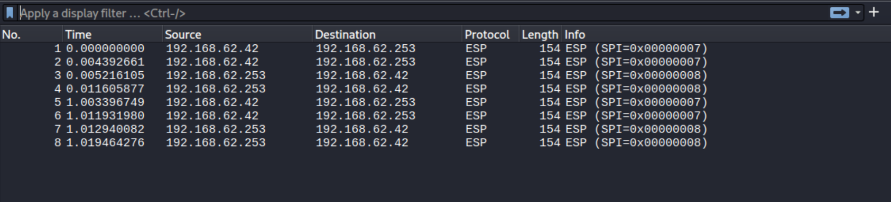
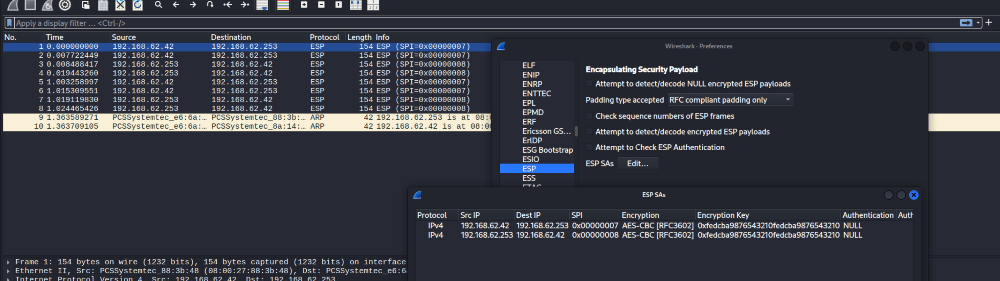

# Lab08

## Setup

**Check if IP forwarding is enabled**

    - `sysctl net.ipv4.ip_forward`

**Add Routes on Homerouter to Company Networks**

    - Internal company network via companyrouter: `sudo nmcli connection modify "System eth1" +ipv4.routes "172.30.0.0/17 192.168.62.253"`
    - DMZ via companyrouter: `sudo nmcli connection modify "System eth1" +ipv4.routes "172.30.128.0/28 192.168.62.253"`
    - `sudo nmcli connection up "System eth1"

**Add Route on Companyrouter to Home Network**

    - Employee home network via homerouter: `sudo nmcli connection modify "System eth1" +ipv4.routes "172.10.10.0/24 192.168.62.42"`
    - `sudo nmcli connection up "System eth1"`

**Change the firewall configuration**

    [firewall.txt](../../firewall.txt)

**Verify routes**

    - Check internet: `ping -c 2 8.8.8.8`
    - Check DNS: `ping -c 2 google.com`
    - Check internal network: `ping -c 2 172.30.0.15`
    - Check DMZ: `ping -c 2 172.30.128.10`
    - Check connection between routers: `tracepath 172.30.0.15`

## MitM Attack

`sudo ettercap -Tq -i eth1 -M arp:remote /192.168.62.42// /192.168.62.253//`

<!-- Format is: /IP/PORT/
/ before IP starts the target specification
// after IP means "all ports" (empty port specification) -->

After setting this up, I opend wireshark (on eth1) and started a capture. I pinged to `172.30.128.10` and `172.30.0.15`. I could see the ICMP packets in wireshark.

### Set up IPsec homerouter -> companyrouter

Paste the script in: "/home/vagrant/ipsec-homerouter.sh"

**Script homerouter:**

```bash
#!/usr/bin/env sh

# IPSec tunnel: homerouter to companyrouter (outgoing direction)
# Clean all previous IPsec stuff
ip xfrm policy flush
ip xfrm state flush
# Security Association variables
SPI7=0x007
ENCKEY7=0xFEDCBA9876543210FEDCBA9876543210
# Define the SA (Security Association) for encryption
ip xfrm state add src 192.168.62.42 dst 192.168.62.253 proto esp spi ${SPI7} mode tunnel enc aes ${ENCKEY7}
# Set up the SP (Security Policy) - traffic FROM home TO company
ip xfrm policy add src 172.10.10.0/24 dst 172.30.0.0/16 dir out tmpl src 192.168.62.42 dst 192.168.62.253 proto esp spi ${SPI7} mode tunnel
ip xfrm policy list
```

`sudo chmod +x /home/vagrant/ipsec-homerouter.sh`
`sudo /home/vagrant/ipsec-homerouter.sh`

**Script companyrouter:**

```bash
#!/usr/bin/env sh

# IPSec tunnel: homerouter to companyrouter (incoming/forward direction)

# Clean all previous IPsec stuff
ip xfrm policy flush
ip xfrm state flush

# Security Association variables (MUST MATCH homerouter)
SPI7=0x007
ENCKEY7=0xFEDCBA9876543210FEDCBA9876543210

# Define the SA (Security Association) for decryption
ip xfrm state add src 192.168.62.42 dst 192.168.62.253 proto esp spi ${SPI7} mode tunnel enc aes ${ENCKEY7}

# Set up the SP (Security Policy) - traffic FROM home TO company (forwarded)
ip xfrm policy add src 172.10.10.0/24 dst 172.30.0.0/16 dir fwd tmpl src 192.168.62.42 dst 192.168.62.253 proto esp spi ${SPI7} mode tunnel

echo "IPsec tunnel configured on companyrouter (incoming/forwarding)"
ip xfrm policy list
EOF
```

`sudo chmod +x /home/vagrant/ipsec-companyrouter.sh`
`sudo /home/vagrant/ipsec-companyrouter.sh`

### Set up IPsec companyrouter -> homerouter

**Script companyrouter**

```bash
#!/usr/bin/env sh

# IPSec tunnel: companyrouter to homerouter (outgoing direction)

# Security Association variables (DIFFERENT SPI for reverse direction)
SPI8=0x008
ENCKEY8=0xFEDCBA9876543210FEDCBA9876543210

# Define the SA (Security Association) for encryption
ip xfrm state add src 192.168.62.253 dst 192.168.62.42 proto esp spi ${SPI8} mode tunnel enc aes ${ENCKEY8}

# Set up the SP (Security Policy) - traffic FROM company TO home
ip xfrm policy add src 172.30.0.0/16 dst 172.10.10.0/24 dir out tmpl src 192.168.62.253 dst 192.168.62.42 proto esp spi ${SPI8} mode tunnel
ip xfrm policy list
```

**Script homerouter**

```bash
#!/usr/bin/env sh

# IPSec tunnel: companyrouter to homerouter (incoming/forward direction)

# Security Association variables (MUST MATCH companyrouter)
SPI8=0x008
ENCKEY8=0xFEDCBA9876543210FEDCBA9876543210

# Define the SA (Security Association) for decryption
ip xfrm state add src 192.168.62.253 dst 192.168.62.42 proto esp spi ${SPI8} mode tunnel enc aes ${ENCKEY8}

# Set up the SP (Security Policy) - traffic FROM company TO home (forwarded)
ip xfrm policy add src 172.30.0.0/16 dst 172.10.10.0/24 dir fwd tmpl src 192.168.62.253 dst 192.168.62.42 proto esp spi ${SPI8} mode tunnel
ip xfrm policy list
```

You can use `sudo ip xfrm policy list` to verify the tunnel.

Now I have set up 2 tunnels (in both directions). I can test it by pinging the dns from the remote-employee. Capture the traffic using the MitM attack.



### Decrypt

Run `sudo ip xfrm state` on the routers

Open your capture in Wireshark.

Go to Edit → Preferences → Protocols → ESP.

Click “Edit” next to “ESP SAs (Security Associations)”.

Add a new entry with:

-   SPI 0x00000007 and 0x00000008
-   IP addresses 192.168.62.253/192.168.62.42
-   Encryption algorithm cbc(aes)
-   Encryption key 0xfedcba9876543210fedcba9876543210

Click OK and apply.

I can't find a way to decrypt the packets...



