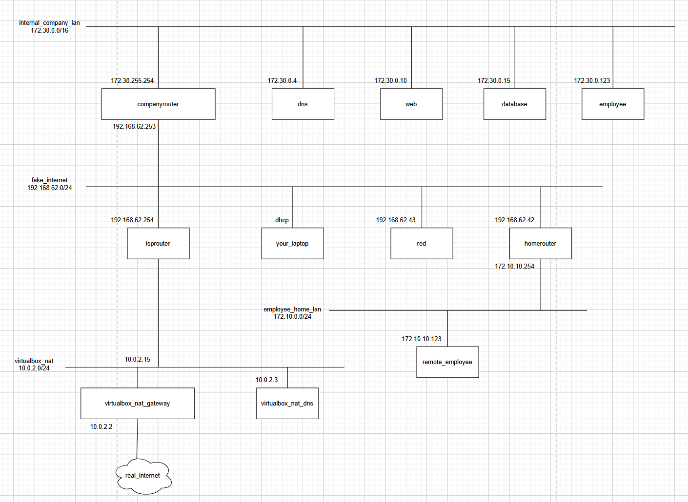

# Cheat sheet

## Addresstable

|    Machine    |        IP         |
| :-----------: | :---------------: |
|   isprouter   | 192.168.62.254/24 |
|               |   10.0.2.15/24    |
| companyrouter | 192.168.62.253/24 |
|               | 172.30.255.254/16 |
|      red      | 192.168.62.43/24  |
|               | 172.10.10.253/24  |
|               |   10.0.2.15/24    |
|      web      |  172.30.0.10/24   |
|      dns      |   172.30.0.4/24   |
|   employee    |  172.30.0.12/24   |

## Machines

### isprouter

isprouter is an Alpine linux machine. Package manager apk.

## Commands

### Package manager apk

|       Task        |         Commands         |
| :---------------: | :----------------------: |
| install a package | `sudo apk add [package]` |

### Change keyboard-layout

`sudo setup-keymap` -> `be` -> `be-iso-alternate` or `sudo localectl setup-keymap be`

### DNS

_nslookup works on Linux and Windows, host and dig only works on Linux_

|                   Task                   |               Commands               |
| :--------------------------------------: | :----------------------------------: |
|              Resolve an URL              |           `nslookup [url]`           |
| Resolve an URL using specific DNS-server | `nslookup [url] [ip/name-dnsserver]` |
|  Resolve an URL with extra information   |        `dig +short NS [url]`         |
|         Reverse lookup using dig         |            `dig -x [ip]`             |
