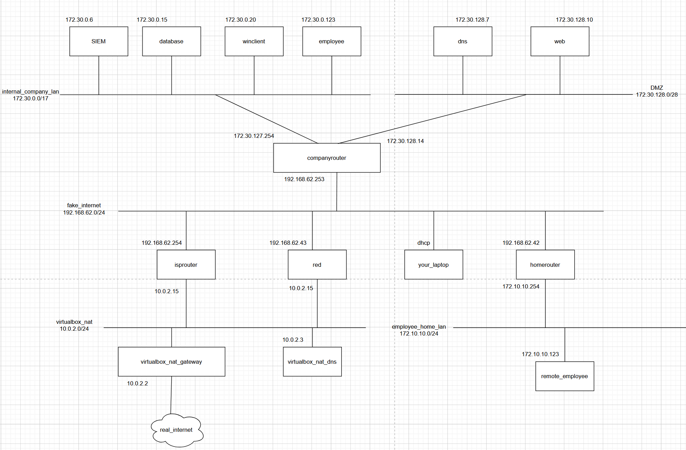

# Overview of the whole network

## Network Diagram

## VM's

### Companyrouter

-   OS: Almalinux 9.6
-   Network:
    -   eth1: fake-internet
    -   eth2: internal-comapny-lan
    -   eth3: DMZ
-   IP's:
    -   eth1: 192.168.62.253/24
    -   eth2: 172.30.127.254/17
    -   eth3: 172.30.128.14/28
-   Default Gateway:

    -   default via 192.168.62.254 dev eth1 proto static metric 100

-   Routes:
    -   172.10.10.0/24 via 192.168.62.42 dev eth1 proto static metric 100
    -   172.17.0.0/16 dev docker0 proto kernel scope link src 172.17.0.1
    -   172.30.0.0/17 dev eth2 proto static scope link metric 101
    -   172.30.0.0/17 dev eth2 proto kernel scope link src 172.30.127.254 metric 101
    -   172.30.128.0/28 dev eth3 proto kernel scope link src 172.30.128.14 metric 102
    -   192.168.62.0/24 dev eth1 proto kernel scope link src 192.168.62.253 metric 100
-   ROUTES (opt)
    -   default via 192.168.62.254 dev eth1 proto static metric 100
    -   default via 192.168.62.254 dev eth2 proto static metric 101
    -   default via 192.168.62.254 dev eth3 proto static metric 102
    -   172.10.10.0/24 via 192.168.62.42 dev eth1 proto static metric 100
    -   172.17.0.0/16 dev docker0 proto kernel scope link src 172.17.0.1
    -   172.30.0.0/17 dev eth2 proto kernel scope link src 172.30.127.254 metric 101
    -   172.30.128.0/28 dev eth3 proto kernel scope link src 172.30.128.14 metric 102
    -   192.168.62.0/24 dev eth1 proto kernel scope link src 192.168.62.253 metric 100
    -   192.168.62.254 dev eth2 proto static scope link metric 101
    -   192.168.62.254 dev eth3 proto static scope link metric 102
-   DNS:
    -   nameserver 172.30.128.7
    -   nameserver 192.168.62.254
-   Firewall: see [firewall.txt](./firewall.txt)

### ISP router

-   OS: Alpine Linux
-   Network:
    -   eth0: Virtualbox-NAT
    -   eth1: fake-internet
-   IP's:
    -   eth0: 10.2.15/24
    -   eth1: 192.168.62.254/24
-   Default Gateway:
    -   default via 10.0.2.2 dev eth0 metric 202
-   Routes:
    -   172.10.10.0/24 via 192.168.62.42 dev eth1
    -   172.30.0.0/17 via 192.168.62.253 dev eth1
    -   192.168.62.0/24 dev eth1 scope link src 192.168.62.254
-   DNS:
    -   nameserver 10.0.2.2

### Homerouter

-   OS: Almalinux 9
-   Network:
    -   eth1: fake-internet
    -   eth2: employee-home-lan
-   IP's:
    -   eth1: 192.168.62.42/24
    -   eth2: 172.10.10.254/24
-   Default Gateway:
    -   default via 192.168.62.254 dev eth1 proto static metric 100
-   Routes:
    -   172.10.10.0/24 dev eth2 proto kernel scope link src 172.10.10.254 metric 101
    -   172.30.0.0/17 via 192.168.62.253 dev eth1
    -   172.30.128.0/28 via 192.168.62.253 dev eth1
    -   192.168.62.0/24 dev eth1 proto kernel scope link src 192.168.62.42 metric 100
-   DNS:
    -   nameserver 192.168.62.254

### Red

-   OS: Kali Linux
-   Network:
    -   eth0: Virtualbox-nat
    -   eth1: fake-internet
-   IP's:
    -   eth0: 10.0.2.15/24
    -   eth1: 192.168.62.43/24
-   Default Gateway:
    -   default via 192.168.62.253 dev eth1 proto static
    -   default via 10.0.2.2 dev eth0 proto dhcp src 10.0.2.15 metric 100
-   Routes:
    -   10.0.2.0/24 dev eth0 proto kernel scope link src 10.0.2.15
    -   10.0.2.2 dev eth0 proto dhcp scope link src 10.0.2.15 metric 1024
    -   172.30.128.0/28 via 192.168.62.253 dev eth1
    -   192.168.25.10 via 10.0.2.2 dev eth0 proto dhcp src 10.0.2.15 metric 1024
    -   192.168.62.0/24 dev eth1 proto kernel scope link src 192.168.62.43
-   DNS:
    -   nameserver 172.30.128.7

### DNS

-   OS: Alpine Linux
-   Network:
    -   eth1: DMZ
-   IP's:
    -   eth1: 172.30.128.7/28
-   Default Gateway:
    -   default via 172.30.128.14 dev eth1 metric 1 onlink
-   Routes:
    -   172.30.128.0/28 dev eth1 scope link src 172.30.128.7
-   DNS:
    -   nameserver 172.30.128.7

### Web

-   OS: Almalinux 9
-   Network:
    -   eth1: DMZ
-   IP's:
    -   eth1: 172.30.128.10/28
-   Default Gateway:
    -   default via 172.30.128.14 dev eth1 proto static metric 100
-   Routes:
    -   172.30.128.0/28 dev eth1 proto kernel scope link src 172.30.128.10 metric 100
-   DNS:
    -   nameserver 172.30.128.7

### Database

-   OS: Alpine Linux
-   Network:
    -   eth1: internal-comapny-lan
-   IP's:
    -   eth1: 172.30.0.15/17
-   Default Gateway:
    -   default via 172.30.127.254 dev eth1 metric 1 onlink
-   Routes:
    -   172.30.0.0/17 dev eth1 scope link src 172.30.0.15
-   DNS:
    -   nameserver 172.30.128.7

### Employee

-   OS: Alpine Linux
-   Network:
    -   eth1: internal-comapny-lan
-   IP's:
    -   eth1: 172.30.0.123/17
-   Default Gateway:
    -   default via 172.30.127.254 dev eth1 metric 1 onlink
-   Routes:
    -   172.30.0.0/17 dev eth1 scope link src 172.30.0.123
-   DNS:
    -   nameserver 172.30.128.7

### SIEM

-   OS: Almalinux 9
-   Network:
    -   eth1: internal-comapny-lan
-   IP's:
    -   eth1: 172.30.0.6/17
-   Default Gateway:
    -   default via 172.30.127.254 dev eth1 proto static metric 100
-   Routes:
    -   172.30.0.0/17 dev eth1 proto kernel scope link src 172.30.0.6 metric 100
-   DNS:
    -   nameserver 172.30.128.7

### Remote-employee

-   OS: Almalinux 9
-   Network:
    -   eth1: employee-home-lan
-   IP's:
    -   172.10.10.123/24
-   Default Gateway:
    -   default via 172.10.10.254 dev eth1 proto static metric 100
-   Routes:
    -   172.10.10.0/24 dev eth1 proto kernel scope link src 172.10.10.123 metric 100
-   DNS:
    -   nameserver 192.168.62.254
